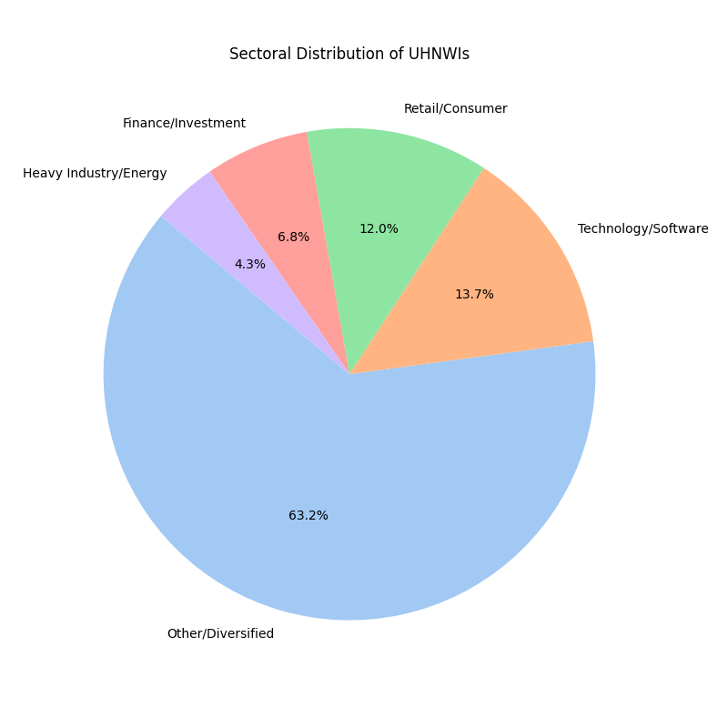
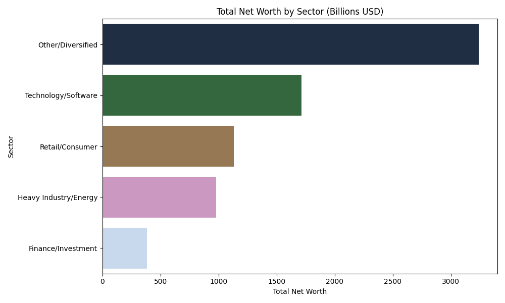
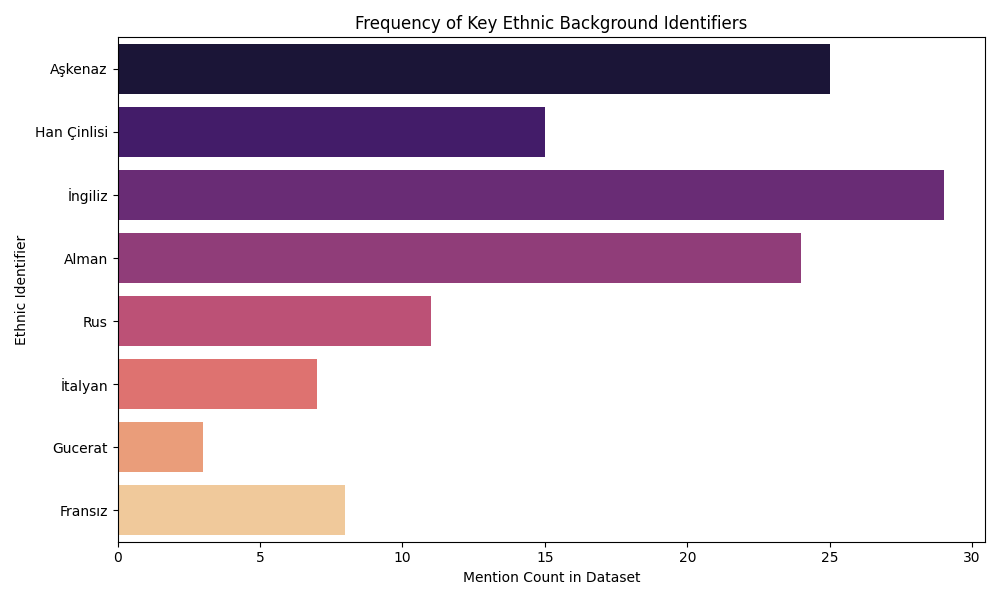
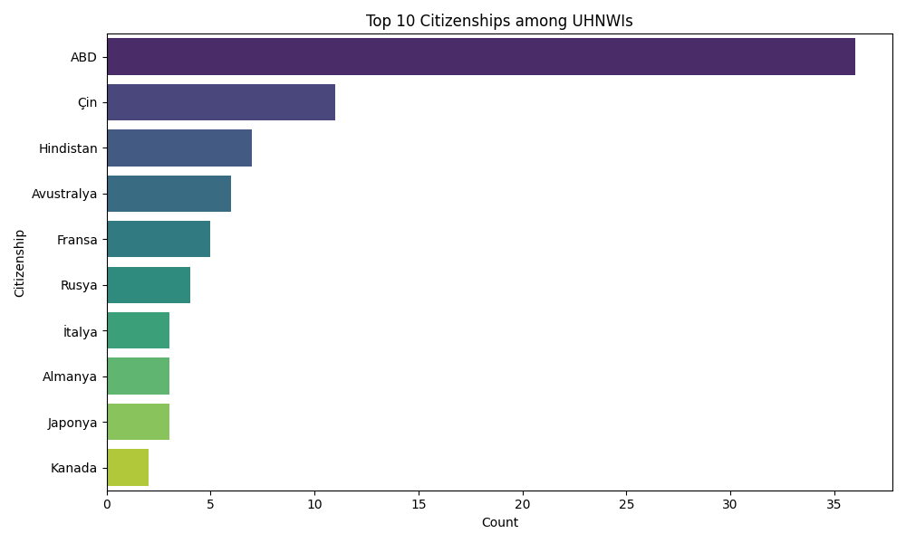

# 🗺️ sermaye-haritasi (Global Capital Mapping Engine)

> *"Kapitalizm bir uygarlık meselesidir; yüzyılların birikimini, toplumların ruhunu ve coğrafyanın kaderini tek bir bilançoda eritir."*  
> — **Fernand Braudel**, *Maddi Uygarlık ve Kapitalizm*

Küresel ölçekte en büyük finansal ve endüstriyel gücü elinde tutan **ilk 120 ultra yüksek net değerli bireyin (UHNWI)** sosyolojik, coğrafi, sektörel ve etnik/ailevi köken ağlarını yapısal bir yaklaşımla inceleyen açık kaynaklı bir veri ve analiz deposudur.

Bu veri tabanı, küresel sermayenin sadece ulus devlet sınırlarıyla değil; tarihsel göç yolları, diaspora ağları, köklü kast/ticaret gelenekleri ve sosyo-kültürel yapılarla nasıl bir korelasyon içinde olduğunu haritalandırmak amacıyla kurulmuştur. Rakamların ötesine geçerek, servetin *genetik ve sosyolojik mirasını* arıyoruz.

---

## 🏛️ Giriş: Sermayenin Görünmez Damarları

Sermaye, hiçbir zaman yalnızca "para" olmamıştır. O; tarihin en büyük kırılmalarından sağ çıkanların, sürgün edilenlerin, okyanusları aşanların ve çağlar boyu biriken kültürel stratejilerin ete kemiğe bürünmüş halidir. Bir çip fabrikasının temelinde sadece silikon değil, yüzyıllık bir diaspora zekası yatabilir. Bir enerji tröstünün arkasında, nesiller boyu aktarılan "eski para"nın toprağı tutma içgüdüsü vardır. Bu repo, o görünmez damarların röntgenini çekmektedir.

---

> *"Servet, güçtür."*  
> — **Thomas Hobbes**, *Leviathan*

## 📊 Makro Veri Özeti & Metodoloji

* **Veri Güncelliği:** Forbes / Bloomberg Küresel Canlı Veri Tabanı (Mayıs 2026)
* **Etnik Sınıflandırma Stratejisi:** Bireylerin sadece mevcut vatandaşlıkları değil; biyolojik ebeveyn kökenleri, tarihsel diaspora aidiyetleri (Aşkenaz, Mizrahi vb.) ve alt etnik kırılımları (Gucerat, Tamil, Han vb.) baz alınmıştır. Sınırlar değişir, aidiyetler kalır.
* **Sektörel Kümelenme:** Ağır Sanayi/Emtia, Yapay Zeka/Çip/Yazılım, Finans/Hedge Fon/Gölge Bankacılık, Lüks Tüketim/Moda ve Perakende/Gıda.

---

## 🏛️ Küresel Sermaye Sicili (İlk 120 Tam Liste)

### Zirve Katmanı: 1 - 25 (Oyun Kurucu Teknoloji ve Sanayi Elitleri)

| # | İsim | Net Varlık (2026) | Birincil Şirket / Kaynak | Resmi Vatandaşlık | Etnik / Ailevi Köken Kırılımı |
|---|---|---|---|---|---|
| 1 | **Elon Musk** | $839.1 B | Tesla, SpaceX, xAI | ABD / G. Afrika | Afrikaner (Hollanda/Alman kökenli Güney Afrikalı) & İngiliz-Kanada |
| 2 | **Larry Page** | $257.0 B | Google (Alphabet) | ABD | Aşkenaz Yahudisi (Anne tarafı) & İngiliz Anglo-Sakson |
| 3 | **Sergey Brin** | $237.0 B | Google (Alphabet) | ABD | Rusya Yahudisi (Aşkenaz diasporası - Moskova göçmeni) |
| 4 | **Jeff Bezos** | $224.0 B | Amazon | ABD | İspanyol/Kastilya (Üvey baba/kültürel) & İngiliz-Alman Anglo-Sakson |
| 5 | **Mark Zuckerberg** | $222.0 B | Meta | ABD | Alman, Avusturya ve Polonya Yahudisi (Aşkenaz) |
| 6 | **Larry Ellison** | $190.0 B | Oracle | ABD | İtalyan (Biyolojik baba) & Rus Yahudisi (Aşkenaz anne/evlat edinen) |
| 7 | **Bernard Arnault & Ailesi** | $171.0 B | LVMH (Lüks Tüketim) | Fransa | Fransız (Kelt / Gallo-Roman sanayi burjuvazisi) |
| 8 | **Jensen Huang** | $154.0 B | NVIDIA | ABD / Tayvan | Tayvanlı (Han Çinlisi - Tainan göçmeni) |
| 9 | **Warren Buffett** | $149.0 B | Berkshire Hathaway | ABD | Hugenot (Fransız Protestanı) & İngiliz-Alman Anglo-Sakson |
| 10 | **Amancio Ortega** | $148.0 B | Inditex (Zara) | İspanya | İspanyol (Galiçyalı / Kastilyalı işçi sınıfı kökenli) |
| 11 | **Steve Ballmer** | $139.0 B | Microsoft / LA Clippers | ABD | İsviçre Almanı (Baba tarafı) & Belarus Yahudisi (Aşkenaz anne) |
| 12 | **Rob Walton** | $134.0 B | Walmart | ABD | İngiliz-Amerikan (Erken koloni dönemi Anglo-Sakson) |
| 13 | **Jim Walton** | $132.0 B | Walmart | ABD | İngiliz-Amerikan (Erken koloni dönemi Anglo-Sakson) |
| 14 | **Alice Walton** | $123.0 B | Walmart | ABD | İngiliz-Amerikan (Erken koloni dönemi Anglo-Sakson) |
| 15 | **Carlos Slim Helú & Ailesi** | $122.0 B | América Móvil / Telekom | Meksika | Lübnanlı (Osmanlı dönemi Meksika'ya göçen Maruni Hristiyan) |
| 16 | **Changpeng Zhao (CZ)** | $110.0 B | Binance | Kanada / BAE | Çinli (Han Çinlisi - Jiangsu doğumlu siyasi mülteci aile) |
| 17 | **Michael Bloomberg** | $109.0 B | Bloomberg LP | ABD | Rusya ve Polonya Yahudisi (Aşkenaz göçmen aile) |
| 18 | **Bill Gates** | $102.0 B | Microsoft / Cascade | ABD | İngiliz, Alman, İskoç ve İrlandalı (Geleneksel WASP burjuvazisi) |
| 19 | **Thomas Peterffy** | $99.0 B | Interactive Brokers | ABD | Macar (Magyar - Soylu ve mülteci aile kökeni) |
| 20 | **Francoise Bettencourt Meyers** | $98.0 B | L'Oréal | Fransa | Fransız & Aşkenaz Yahudisi (Meyers ailesi entegrasyonu) |
| 21 | **Zhang Yiming** | $69.3 B | ByteDance (TikTok) | Çin | Çinli (Han Çinlisi - Fujian yerlisi) |
| 22 | **Mukesh Ambani** | $96.0 B | Reliance Industries | Hindistan | Hintli (Gucerat kökenli - Vaishya Modh Bania ticaret kastı) |
| 23 | **Gautam Adani** | $63.8 B | Adani Group | Hindistan | Hintli (Gucerat kökenli - Jain/Ticaret kastı altyapısı) |
| 24 | **Charles Koch** | $91.0 B | Koch Industries | ABD | Hollanda (Frizya göçmeni), Alman ve İngiliz köken karması |
| 25 | **Julia Koch & Ailesi** | $91.0 B | Koch Industries Varisi | ABD | İngiliz-Amerikan (Geleneksel Anglo-Sakson taşra burjuvazisi) |

---

### Orta Katman: 26 - 60 (Emtia, Donanım ve Küresel Tüketim Devleri)

| # | İsim | Net Varlık (2026) | Birincil Şirket / Kaynak | Resmi Vatandaşlık | Etnik / Ailevi Köken Kırılımı |
|---|---|---|---|---|---|
| 26 | **Zhong Shanshan** | $85.0 B | Nongfu Spring (Su/İlaç) | Çin | Çinli (Han Çinlisi - Hangzhou işçi sınıfı kökenli) |
| 27 | **Dieter Schwarz** | $82.0 B | Schwarz Gruppe (Lidl) | Almanya | Alman (Cermen - Geleneksel Mittelstand disiplini) |
| 28 | **Mark Mateschitz** | $45.8 B | Red Bull | Avusturya | Avusturyalı & Hırvat (Matešić köklü sınır göçmeni baba tarafı) |
| 29 | **Tadashi Yanai & Ailesi** | $74.0 B | Fast Retailing (Uniqlo) | Japonya | Japon (Yamato halkı - Geleneksel terzi ve esnaf aile) |
| 30 | **Ken Griffin** | $72.0 B | Citadel (Hedge Fon) | ABD | Kelt/İrlanda kökenli & İngiliz-Alman Amerikalı |
| 31 | **Ma Huateng (Pony Ma)** | $53.8 B | Tencent | Çin | Çinli (Han Çinlisi - Guangdong liman bürokrasisi kökenli) |
| 32 | **Robin Zeng** | $53.2 B | CATL (Pil Teknolojisi) | Çin | Çinli (Han Çinlisi - Ningde köylü ve akademisyen kökenli) |
| 33 | **Iris Fontbona & Ailesi** | $52.6 B | Luksic Group (Maden) | Şili | İspanyol (Kastilyalı) & Hırvat (Andrónico Luksic soyu) |
| 34 | **Masayoshi Son** | $51.5 B | SoftBank | Japonya | Zainichi Koreli (Japonya işgali döneminde göçen Koreli azınlık) |
| 35 | **Jacqueline Mars** | $49.1 B | Mars Inc. (Gıda/Şeker) | ABD | İngiliz-Amerikan (Köklü Anglo-Sakson Protestan sanayici soyu) |
| 36 | **John Mars** | $49.1 B | Mars Inc. (Gıda/Şeker) | ABD | İngiliz-Amerikan (Köklü Anglo-Sakson Protestan sanayici soyu) |
| 37 | **Lukas Walton** | $48.9 B | Walmart | ABD | İngiliz-Amerikan (Anglo-Sakson) & Alman göçmeni (Anne tarafı) |
| 38 | **Giovanni Ferrero** | $48.8 B | Ferrero (Nutella) | İtalya | İtalyan (İtalik/Latin - Piedmont pastacı ve esnaf soyu) |
| 39 | **Li Ka-shing** | $47.0 B | CK Hutchison | Hong Kong / Çin | Çinli (Han Çinlisi - Teochew alt etnik mülteci grubu) |
| 40 | **Colin Huang** | $45.9 B | Pinduoduo / Temu | Çin | Çinli (Han Çinlisi - Hangzhou fabrika işçisi kökenli) |
| 41 | **Alain Wertheimer** | $44.5 B | Chanel | Fransa | Fransız Yahudisi (Aşkenaz - Holokost mültecisi Pierre soyu) |
| 42 | **Gerard Wertheimer** | $44.5 B | Chanel | Fransa / İsviçre | Fransız Yahudisi (Aşkenaz - Holokost mültecisi Pierre soyu) |
| 43 | **Shiv Nadar** | $43.8 B | HCL Technologies | Hindistan | Hintli (Güney Hindistan - Tamil etnik grubu / Elit kast) |
| 44 | **Vladimir Potanin** | $42.1 B | Nornickel | Rusya | Rus (Doğu Slavı - SSCB bürokrasi ve oligarşi geçişli) |
| 45 | **William Ding** | $40.9 B | NetEase (Oyun/İnternet) | Çin | Çinli (Han Çinlisi - Ningbo bilgisayar mühendisliği kökenli) |
| 46 | **Savitri Jindal & Ailesi** | $40.5 B | O.P. Jindal (Çelik) | Hindistan | Hintli (Kuzey Hindistan - Haryana / Marwari ticaret topluluğu) |
| 47 | **David Thomson & Ailesi** | $39.8 B | Thomson Reuters | Kanada | İskoç-Kanadalı & İngiliz (Kraliyet unvanlı Anglo-Sakson) |
| 48 | **Sergey Popov** | $38.7 B | MDM Bank / Kömür | Rusya | Rus (Doğu Slavı - Urallar sanayi havzası kökenli) |
| 49 | **Miriam Adelson** | $38.2 B | Las Vegas Sands | ABD / İsrail | İsrail Yahudisi (Polonya göçmeni Aşkenaz mülteci soyu) |
| 50 | **George Soros** | $37.5 B | Soros Fund / Open Society| ABD / Macaristan | Macar Yahudisi (Aşkenaz - Orijinal soyadı Schwartz olan mülteci) |
| 51 | **Leonid Mikhelson** | $36.8 B | Novatek (Doğalgaz) | Rusya | Rus-Yahudi Karması (Baba Aşkenaz mühendis, anne Slav) |
| 52 | **Stefan Quandt** | $36.2 B | BMW | Almanya | Alman (Cermen - Köklü Prusya/Kuzey Almanya dokuma sanayicileri) |
| 53 | **Susanne Klatten** | $35.9 B | BMW / Altana | Almanya | Alman (Cermen - Köklü Prusya/Kuzey Almanya dokuma sanayicileri) |
| 54 | **Cyrus Poonawalla** | $34.6 B | Serum Institute | Hindistan | Hintli (Parsi topluluğu - İran göçmeni Zerdüşt kökenli Persler) |
| 55 | **Rupert Murdoch** | $33.8 B | News Corp (Fox/WSJ) | ABD / Avustralya | İskoç, İngiliz ve İrlandalı Presbiteryen Anglo-Sakson soyu |
| 56 | **Lakshmi Mittal** | $32.9 B | ArcelorMittal | Hindistan / Birleşik Krallık| Hintli (Marwari etnik/ticaret kastı grubu - Rajasthan yerlisi) |
| 57 | **Vagit Alekperov** | $32.2 B | Lukoil | Rusya / Azerbaycan | Azerbaycan Türkü (Baba tarafı Bakü) & Rus (Slav anne) |
| 58 | **Emmanuel Besnier** | $31.5 B | Lactalis (Peynir/Süt) | Fransa | Fransız (Kelt / Gallo-Roman - Batı Fransa burjuvazisi) |
| 59 | **Abigail Johnson** | $30.8 B | Fidelity Investments | ABD | İngiliz-Amerikan (Boston Brahmins adı verilen yerleşik elit WASP) |
| 60 | **Klaus-Michael Kühne**| $30.5 B | Kühne + Nagel | Almanya / İsviçre | Alman (Cermen - Hanseatik Hamburg deniz ticaret aristokrasisi) |

---

### Altyapı ve Finans Katmanı: 61 - 95 (Lojistik, Fonlar ve Ağ Yapıları)

| # | İsim | Net Varlık (2026) | Birincil Şirket / Kaynak | Resmi Vatandaşlık | Etnik / Ailevi Köken Kırılımı |
|---|---|---|---|---|---|
| 61 | **Andrey Melnichenko**| $29.8 B | EuroChem / SUEK | Rusya / Belarus | Belaruslu (Baba tarafı) & Rus (Slav kökenli yeni nesil oligark) |
| 62 | **Eric Yu** | $29.2 B | Yonyou (Yazılım) | Çin | Çinli (Han Çinlisi - Yazılım ve kurumsal entegrasyon burjuvazisi) |
| 63 | **Renáta Kellnerová** | $28.7 B | PPF Group (Finans) | Çekya | Çek (Batı Slavı - Kadife Devrim sonrası yükselen aile sermayesi) |
| 64 | **Stefan Persson** | $28.1 B | H&M | İsreç | İsveçli (İskandinav/Cermen - Kuzey Avrupa tekstil hanedanlığı) |
| 65 | **Masahiro Miki** | $27.6 B | ABC-Mart (Perakende) | Japonya | Zainichi Koreli (Kore asıllı ikinci kuşak perakende dehası) |
| 66 | **Graeme Hart** | $27.0 B | Rank Group (Ambalaj) | Yeni Zelanda | İskoç-İrlandalı & Yeni Zelandalı (Anglo-Sakson self-made) |
| 67 | **Jeff Yass** | $26.8 B | Susquehanna (SIG) | ABD | Amerikan Yahudisi (Aşkenaz - Niceliksel finans ve ByteDance fonu) |
| 68 | **Piero Ferrari** | $26.5 B | Ferrari | İtalya | İtalyan (Latin - Emilia-Romagna motor ve sanayi havzası) |
| 69 | **Dilip Shanghvi** | $26.1 B | Sun Pharmaceutical | Hindistan | Hintli (Gucerat kökenli - Mumbai merkezli ticaret ağı) |
| 70 | **James Simons Mirasçıları**| $25.8 B | Renaissance Tech | ABD | Amerikan Yahudisi (Aşkenaz - Algoritmik finans hanedanlığı) |
| 71 | **Eduardo Saverin** | $25.4 B | Facebook / B Capital | Brezilya / Singapur | Brezilya Yahudisi (Almanya'dan kaçan Aşkenaz mülteci torunu) |
| 72 | **John Menard Jr.** | $25.1 B | Menards (Yapı Market)| ABD | Fransız-Kanadalı & İngiliz-Alman (Orta Batı sanayicisi) |
| 73 | **Aliko Dangote** | $24.8 B | Dangote Group | Nijerya | Nijeryalı (Kuzey Nijerya - Ticari dehasıyla bilinen Hausa etnik grubu) |
| 74 | **Shivon Zilis & Ailesi**| $24.5 B | xAI / Neuralink | Kanada / ABD | Hintli (Pencap kökenli anne) & Ukraynalı-Kanadalı (Baba tarafı) |
| 75 | **Michael Kadoorie** | $24.2 B | CLP Holdings | Hong Kong | Mizrahi Yahudisi (Osmanlı Bağdat'ından çıkıp Hindistan'a göçen soy) |
| 76 | **German Larrea** | $23.9 B | Grupo México (Maden) | Meksika | Meksikalı (İspanyol/Kastilya kökenli sömürge dönemi aristokrasisi) |
| 77 | **He Xiangjian** | $23.5 B | Midea Group (Beyaz Eşya) Çin | Çinli (Han Çinlisi - Guangdong sıfırdan gelen sanayi üreticisi) |
| 78 | **Jean-Michel Besnier**| $23.2 B | Lactalis Varisi | Fransa | Fransız (Kelt / Gallo-Roman - Geleneksel tarım ve süt sanayii) |
| 79 | **Tim Cook** | $22.8 B | Apple | ABD | İngiliz-Amerikan (Güney Alabama yerlisi Anglo-Sakson Protestan) |
| 80 | **Jean-Louis v. d. Velde**| $38.0 B | Tether / Bitfinex | Hollanda / Asya | Hollandalı (Cermen - Kripto finans ve stabil coin mimarı) |
| 81 | **Giancarlo Devasini** | $37.8 B | Tether / Bitfinex | İtalya | İtalyan (Latin - Torino tıp/teknoloji kökenli dijital finansör) |
| 82 | **Alexey Mordashov** | $37.0 B | Severstal (Demir-Çelik) Rusya | Rus (Doğu Slavı - Çerepovets metalürji işçisi aile kökenli) |
| 83 | **MacKenzie Scott** | $36.5 B | Amazon Mirası | ABD | İngiliz, İrlandalı ve İskoç (Geleneksel Anglo-Sakson akademisyen) |
| 84 | **Henry Samueli** | $36.2 B | Broadcom (Yarı İletken) | ABD | Polonya Yahudisi (Aşkenaz - Toplama kamplarından sağ kurtulan aile) |
| 85 | **Chen Tianshi** | $35.5 B | Cambricon (AI Çip) | Çin | Çinli (Han Çinlisi - Jiangxi bilgisayar ve çip akademisi ekolü) |
| 86 | **Reinhold Würth** | $34.8 B | Würth Grubu | Germany | Alman (Cermen - Baden-Württemberg vida ve hırdavat hanedanı) |
| 87 | **Michal Strnad** | $34.1 B | Czechoslovak Group | Çekya | Çek (Batı Slavı - Savunma sanayii ve ağır mühimmat baronu) |
| 88 | **Radhakishan Damani** | $33.5 B | Avenue Supermarts | Hindistan | Hintli (Marwari ticaret ve borsa topluluğu - Rajasthan) |
| 89 | **Van Beuren Ailesi** | $32.8 B | Campbell Soup / Oto | ABD | Alman-Amerikan (Orijinal soyadı Greisler) & İngiliz Anglo-Sakson |
| 90 | **Gianluigi Aponte** | $44.5 B | MSC (Deniz Taşımacılığı) İtalya / İsviçre | İtalyan (Latin - Sorrento antik denizci ve kaptan soyu) |
| 91 | **Rafaela Aponte** | $44.5 B | MSC Kurucu Ortağı | İsviçre / İsrail | İsviçreli & Yahudi (Cenevre/Hayfa bankacılık ve finans elitleri) |
| 92 | **Andrea Pignataro** | $42.6 B | ION Group (Yazılım) | İtalya / İngiltere | İtalyan (Latin - Wall Street veri analitiği ve yazılım baronu) |
| 93 | **Thomas Frist Jr.** | $41.1 B | HCA Healthcare | ABD | İngiliz-Amerikan (Geleneksel Güney elitleri - Anglo-Sakson) |
| 94 | **Zhang Bo & Ailesi** | $41.7 B | China Hongqiao | Çin | Çinli (Han Çinlisi - Shandong alüminyum ve ağır sanayi grubu) |
| 95 | **Stephen Schwarzman** | $53.4 B | Blackstone (Emlak/PE) | ABD | Alman ve Rus Yahudisi (Aşkenaz - Küresel özel sermaye mimarı) |

---

### Temel Sektör ve Altyapı Katmanı: 96 - 120 (Eski Para ve Yeni Nesil Çip Girişimleri)

| # | İsim | Net Varlık (2026) | Birincil Şirket / Kaynak | Resmi Vatandaşlık | Etnik / Ailevi Köken Kırılımı |
|---|---|---|---|---|---|
| 96 | **Jack Ma** | $45.4 B | Alibaba | Çin | Çinli (Han Çinlisi - Hangzhou geleneksel müzisyen aile kökenli) |
| 97 | **Dan Gilbert** | $36.2 B | Rocket Companies | ABD | Amerikan Yahudisi (Aşkenaz - Detroit finans ve mortgage baronu) |
| 98 | **Len Blavatnik** | $37.8 B | Access Industries | ABD / İngiltere | Ukrayna Yahudisi (Aşkenaz - Odessa doğumlu sanayi/müzik devrimcisi) |
| 99 | **Robert Pera** | $34.3 B | Ubiquiti Networks | ABD | İtalyan-Amerikan (Latin göçmen köken) & İngiliz Anglo-Sakson |
| 100| **Gina Rinehart** | $25.5 B | Hancock Prospecting | Avustralya | İskoç & İngiliz-Avustralyalı (İlk koloniciler - Demir madeni kralı) |
| 101| **David Tepper** | $24.6 B | Appaloosa Management | ABD | Amerikan Yahudisi (Aşkenaz - Wall Street riskli varlık avcısı) |
| 102| **Vladimir Lisin** | $24.2 B | NLMK (Demir-Çelik) | Rusya | Rus (Doğu Slavı - Sibirya maden mühendisliği ve metalürji ekolü) |
| 103| **Harry Triguboff** | $23.4 B | Meriton (Emlak) | Avustralya | Rus Yahudisi (Aşkenaz - Bolşeviklerden Çin'e, oradan Sidney'e kaçan soy)|
| 104| **Melanie Perkins** | $23.0 B | Canva | Avustralya | Sri Lankalı Burgher (Avrupa/Portekiz-Asya), Filipinli & Avustralyalı |
| 105| **Cliff Obrecht** | $23.0 B | Canva Ortağı | Avustralya | Alman-Avustralyalı & İngiliz (Geleneksel taşra burjuvazisi) |
| 106| **Andrew Forrest** | $20.3 B | Fortescue Metals | Avustralya | İskoç-İrlandalı & Avustralyalı (Eski Para / Aristokrat aile) |
| 107| **John Doerr** | $19.5 B | Kleiner Perkins (VC) | ABD | Alman-Amerikan & İngiliz (Silikon Vadisi'ni fonlayan entelektüel köken)|
| 108| **Wang Chuanfu** | $19.1 B | BYD (Elektrikli Araç) | Çin | Çinli (Han Çinlisi - Anhui marangoz kökenli yetim/deha mühendis) |
| 109| **Anthony Pratt** | $18.8 B | Pratt Industries | Avustralya | Polonya Yahudisi (Aşkenaz - 1930'larda Melbourne'e kaçan mülteci aile)|
| 110| **Eric Schmidt** | $35.5 B | Google / White Stork | ABD | Alman & İngiliz (Yapay zeka, otonom savunma ve askeri drone fonları)|
| 111| **Harold Hamm** | $20.1 B | Continental Resources | ABD | İngiliz-Amerikan (Oklahoma pamuk işçisi / Fracking petrol devrimcisi)|
| 112| **Mikhail Fridman** | $29.1 B | Alfa-Bank / LetterOne | Rusya / Ukrayna | Ukrayna Yahudisi (Aşkenaz - SSCB askeri sanayi mühendisi aile) |
| 113| **David Cheriton** | $28.4 B | Stanford / Google Melek | Kanada | Kanadalı & İngiliz (Stanford akademisi - İlk çek yatırımcısı) |
| 114| **Jan Koum** | $27.9 B | WhatsApp / Meta | ABD / Ukrayna | Ukrayna Yahudisi (Aşkenaz - Yemek kuponuyla büyüyen mülteci dahi) |
| 115| **Donald Bren** | $27.5 B | Irvine Company (Emlak) | ABD | Aşkenaz Yahudisi (Hollywood yapımcısı baba) & İrlandalı-Amerikalı anne|
| 116| **Luis Carlos Sarmiento**| $26.8 B | Grupo Aval (Finans) | Kolombiya | Kolombiyalı (İspanyol sömürge dönemi köklü Kastilya aristokrasisi) |
| 117| **Andreas v. Bechtolsheim**|$26.2 B| Arista Networks | Almanya / ABD | Alman (Cermen - Bavyera kökenli donanım mimarı ve Google sponsoru)|
| 118| **Ernesto Bertarelli** | $25.7 B | Serono (Biyoteknoloji) | İsviçre / İtalya | İtalyan & İsviçreli (Latin - İlaç ve kısırlık tedavisi hanedanı) |
| 119| **Terry Gou** | $25.1 B | Foxconn (Elektronik) | Tayvan | Tayvanlı (Han Çinlisi - İç savaştan kaçan ana kara mültecisi asker çocuk)|
| 120| **Yusuf Ali MA** | $12.5 B | LuLu Group (Perakende) | Hindistan / BAE | Hintli (Güney Hindistan - Kerala / Müslüman Mappila topluluğu) |

---


## 📚 Felsefi Çerçeve ve Ansiklopedik Derinlik

Sermaye sadece rakamlardan ibaret değildir; sosyolojik ve felsefi bir arka planı vardır. Veritabanımızdaki milyarderlerin nasıl ortaya çıktığını anlamak için hazırladığımız özel analiz dosyalarımızı inceleyin:

* 📖 **[Sermaye Teorileri: Rakamların Arkasındaki Sosyoloji](docs/theories_of_capital.md)** — Bourdieu, Piketty ve Schumpeter ekseninde sermayenin üç hali.
* 📖 **[Sürgün ve Para: Diaspora Ağlarının Finansal Refleksleri](docs/diaspora_networks.md)** — Aşkenazlar, Parsiler ve Denizaşırı Çinlilerin hayatta kalma stratejisi olarak finans.
* 📖 **[Tekno-Feodalizm: Veri Derebeylikleri ve Yeni Serfler](docs/techno_feudalism.md)** — Silikon Vadisi elitlerinin dijital rantı nasıl topladığı.
* 📖 **[Eski Para ve Yeni Para: Sermayenin Karakter Çatışması](docs/old_money_vs_new_money.md)** — Veblen'in izinde sessiz lüks ve şatafatlı tüketim arasındaki statü savaşı.

---

## 🖼️ Görsel Hafıza: Analiz Çıktıları

Kod tabanımızdaki analiz motorları tarafından üretilen güncel demografik ve sektörel izdüşümler:






---

## 🧩 Sosyolojik ve Etnik Kesişim Analizleri

> *"Sermaye, ölü emektir; ancak vampir gibi, yalnızca canlı emeği ve tarihsel mirası emerek yaşar."*  
> — **Karl Marx**, *Kapital* (Uyarlanmıştır)

Repo içeriğindeki veriler derinlemesine incelendiğinde, küresel sermayenin rastgele dağılmadığı, aksine belirli **kültürel, psikolojik ve tarihsel nişlerde** kök saldığı görülmektedir. Zenginlik bir tesadüf değil, yüzlerce yıllık bir adaptasyon sürecinin sonucudur:

### 1. Aşkenaz Yahudisi Diasporası (Finans & Yazılım Ağları)
* **Karakteristik Semptom:** Wall Street'in büyük "Kaldıraçlı/Alternatif Finans" yapıları ve Silikon Vadisi'nin algoritmik temelleri bu ekosistemin elinde konsolide olmuştur. 
* **Felsefi Kökler:** Tarihsel olarak Avrupa'daki fiziki mülkiyet (toprak/tarım) yasakları, bu topluluğu nesiller boyu "taşınabilir entelektüel sermayeye" (matematik, tıp, finans, hukuk) yönlendirmiştir. Fiziksel sınırların yıkılabileceği korkusu, tamamen soyut ve algoritmik sistemler kurma refleksini doğurmuştur.

### 2. Han Çinlileri (Üretim & Ölçek Mühendisliği)

> *"Kazanmayı bilenler, koşullar henüz şekillenmeden zaferi tasarlayanlardır."*  
> — **Sun Tzu**, *Savaş Sanatı*

* **Karakteristik Semptom:** Batı sermayesinin aksine tamamen "fiziksel üretim, batarya, çip ve lojistik entegrasyon" ile "agresif algoritmalar" üzerine kuruludur.
* **Felsefi Kökler:** Çin iç savaşı, Kültür Devrimi ve devasa mülteci geçmişleri, bu grupta inanılamaz derecede yüksek bir "hayatta kalma" güdüsü ve risk iştahı yaratmıştır. Maddeye hükmetme ve dünyayı fabrikaya çevirme vizyonu, tarihsel kıtlık sendromlarının bir antitezidir.

### 3. Guceratlılar ve Parsiler (Hindistan'ın Lokomotifleri)
* **Karakteristik Semptom:** Nüfusun mikro bir azınlığı olmalarına rağmen ülkenin çelik, ilaç, perakende ve teknoloji hatlarını yönetirler.
* **Felsefi Kökler:** Zerdüşt Pers göçmenleri olan Parsiler ve ticaret kastından gelen Guceratlılar, yüzyıllardır kapalı bir ticaret loncası kültürüyle korunmuştur. Güvenin sadece kan bağıyla sağlandığı bu coğrafyalarda, aile holdingleri birer mini-devlet gibi işler.

### 4. Anglo-Sakson "Eski Para" (Old Money) Dayanıklılığı

> *"Zaman paradır. İtibar paradır. Para, kendi doğası gereği üretken ve çoğalgandır."*  
> — **Benjamin Franklin** (Max Weber, *Protestan Ahlakı ve Kapitalizmin Ruhu*nda aktarır)

* **Karakteristik Semptom:** Perakende, temel gıda, enerji ve madencilik gibi "dünya yıkılsa bile işlemeye devam edecek" dev fiziksel tekelleri tutarlar.
* **Felsefi Kökler:** Protestan çalışma ahlakı ve mülkiyetin kutsallığı. Geleneksel "WASP" burjuvazisi, serveti şatafatla değil, kuşaklararası vakıflar, arazi sahipliği ve aile meclisleriyle sessizce korur. Onlar için sermaye, bir hanedanlık sancağıdır.

---

## 🛠️ Kurulum ve Katkıda Bulunma

Bu veri tabanı statik bir müze değil, yaşayan bir organizmadır.

### Geliştirici Ortamı:
```bash
# Repoyu klonlayın
git clone https://github.com/arch-yunus/sermaye-haritasi.git

# Proje dizinine girin
cd sermaye-haritasi

# Bağımlılıkları yükleyin
pip install -r requirements.txt

# Çekirdek veri setini oluşturun ve analizleri çalıştırın
python scripts/extract_data.py
python scripts/analyze_demographics.py
python scripts/analyze_sectors.py
```

### Katkı Sağlama Protokolü:
Yeni bir milyarderin köken şifrelerini eklemek veya analiz algoritmalarına felsefi/istatistiksel bir boyut katmak için tarihsel kaynaklarla birlikte (biyografiler, soykütüğü dokümanları) bir **Pull Request (PR)** açın.

---

> *"Tarih, sadece savaşların değil, mülkiyetin el değiştirmesinin kaydıdır."*  
> — **İbn Haldun**, *Mukaddime*

